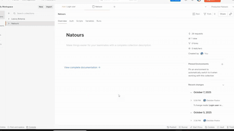

# 🌍 Natours  
> *"Don't just copy the code from the course — you will truly understand how each technology actually works!"*  
> — **Jonas Schmedtmann**  

*A RESTful API for managing tours, users, and reviews — built with Node.js, Express.js, and MongoDB.*  

---

## 🚀 Live Demo  

🖥️ **Deployed and running:**  
👉 [Natours Live on Render](https://natours-hp16.onrender.com/)  

  

---

## 📖 Overview  

**Natours** is a full-featured backend and service with a simple server-side rendered frontend built as part of the **Node.js, Express, and MongoDB Bootcamp by Jonas Schmedtmann (Udemy)** — successfully completed with certification in 2025.  

The project demonstrates strong backend principles, including **REST API design**, **authentication**, **error handling**, and **scalability**.  

This API powers a tour management system where users can:  
- Browse and filter available tours  
- Sign up, log in, and manage their account data  
- Leave reviews and ratings  
- Securely book tours  

**⚠️ Note: Not all features are supported by the frontend**  

---

## ✨ Features  

- 🔐 **Authentication & Authorization:** JWT + cookies, password hashing, role-based access control  
- ⚙️ **Advanced Routing:** Nested routes for tours and reviews  
- 🧭 **Query Features:** Filtering, sorting, field limiting, and pagination  
- 🧱 **Data Modeling:** MongoDB + Mongoose schema relationships  
- 🧰 **Error Handling:** Global error controller and middleware stack  
- 🧑‍💻 **Security:** Rate limiting, data sanitization, and environment-based configuration  
- 🚀 **Deployment Ready:** Configured for production (Render) with `.env` variables  

---

## 🛠 Tech Stack  

**Backend:**  
- Node.js  
- Express.js  
- MongoDB + Mongoose  
- JWT Authentication  

**Utilities & Tools:**  
- Multer (file uploads)
- Postman (API testing)  
- Nodemon (development)  
- dotenv (environment management)  
- Render (deployment)  

---

## 🎓 About the Course  

This project was developed as part of the **[“Node.js, Express, MongoDB Bootcamp”](https://www.udemy.com/course/nodejs-express-mongodb-bootcamp/) by Jonas Schmedtmann** — a comprehensive backend engineering course focused on real-world RESTful API design.  

📜 **Certificate of Completion:** *Issued 2025, Udemy*  
*(Not linked publicly for privacy reasons.)*  

---

## 🎥 Showcase  

Example API routes tested in Postman:  
  

Example JSON response:  
```json
{
    "status": "success",
    "data": {
        "data": {
            "startLocation": {
                "type": "Point",
                "coordinates": [
                    -80.185942,
                    25.774772
                ],
                "address": "301 Biscayne Blvd, Miami, FL 33132, USA",
                "description": "Miami, USA"
            },
            "_id": "5c88fa8cf4afda39709c2955",
            "name": "The Sea Explorer",
            "duration": 7,
            "maxGroupSize": 15,
            "difficulty": "medium",
            "ratingsAverage": 4.8,
            "ratingsQuantity": 6,
            "price": 498,
            "summary": "Exploring the jaw-dropping US east coast by foot and by boat",
            "description": "Lorem ipsum dolor sit amet...",
            "imageCover": "tour-2-cover.jpg",
            "images": [
                "tour-2-1.jpg",
                "tour-2-2.jpg",
                "tour-2-3.jpg"
            ],
            "startDates": [
                "2021-06-19T09:00:00.000Z",
                "2021-07-20T09:00:00.000Z",
                "2021-08-18T09:00:00.000Z"
            ],
            "secretTour": false,
            "locations": [...],
            "guides": [...],
            "slug": "the-sea-explorer",
            "__v": 0,
            "durationWeeks": 1,
            "reviews": [...],
            "id": "5c88fa8cf4afda39709c2955"
        }
    }
}
```

---

## 🧩 How It Works  

- **Users:**  
  - Sign up / log in  
  - Update personal data and passwords  
  - Access tours and reviews  

- **Admins / Guides:**  
  - Manage tours, users, and reviews  
  - Restrict access via JWT roles  

- **Security & Performance:**  
  - Rate limiting, data sanitization, and header protection  
  - Optimized for production environments  

---

## 📄 License  

This project is licensed under the **MIT License** — free to use, modify, and distribute with attribution.  

---

## 📩 Contact  

💡 **Developer:** Desislav Pavlov  
📧 **Email:** makotashako@gmail.com  
🐙 **GitHub:** [DesislavPavlov](https://github.com/DesislavPavlov)  
🔗 **LinkedIn:** [Desislav Pavlov](https://www.linkedin.com/in/developer-d-pavlov/)  
